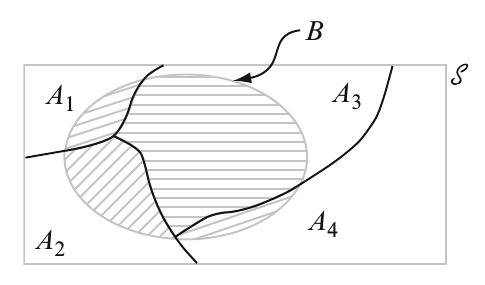

# Probability

## Introduction[^1] {-}

The random variation associated with _measurement_ procedures in a scientific analysis requires a framework in which the **uncertainty** and **variability** that are inherent in the procedure can be handled. The key goal of Probability and Statistical modelling is to establish a mathematical framework within which _random_ variation (due, for example, to experimental error or natural variation) can be quantified so that
_systematic_ variation (arising due to potentially important biological differences) can be studied.  

[^1]: Reproduced with permission from http://www.math.mcgill.ca/dstephens/


Broadly, the \textit{Scientific Process} involves several different stages:  

\begin{equation*}
\begin{array}{cl}
\text{{THEORETICAL MODELLING}} & \rightarrow \text{{MATHEMATICAL/PROBABILISTIC MODELLING}} \\
\downarrow &  \\
\text{{PREDICTION}} &  \\
\downarrow &  \\
\text{{EXPERIMENTATION/OBSERVATION}} &  \\
\downarrow &  \\
\text{{VALIDATION}} &
\end{array}
\end{equation*}  


_Mathematical/Probabilistic_ _modelling_ facilitates PREDICTION; _Statistical Analysis_ provides the means of validation
of predicted behaviour.  

To explain the variation in observed data, we need to introduce the concept of a _probability distribution_. Essentially we need
to be able to model, or specify, or compute the _chance_ of observing the data that we collect or expect to collect. This will then allow us to assess how likely the data were to occur by chance alone, that is, how _surprising_ the observed data are in light of an assumed theoretical model.

For example, consider two nucleotide sequences of the same length that we wish to assess for similarity:

```{example, name="Two nucleotide sequences"}
\begin{equation*}
\begin{array}{ll}
\text{{Sequence 1}}{\qquad } & ATAGTAGATACGCACCGAGGA \\
&  \\
\text{{Sequence 2}}{\qquad } & ATCTTAGATAGGCACTGAGGA
\end{array}
\end{equation*}

How can we assess sequence similarity formally ? The number of discordant positions is 4, but how informative is that summary measure ? Perhaps we need to assess the chance, for example, that a point mutation $$ A\rightarrow C $$ occurs (as in the discordant position 3) in unit evolutionary time. Perhaps the chance of observing a sub-sequence
\begin{equation*}
ATCTTA
\end{equation*}
rather than
\begin{equation*}
ATAGTA
\end{equation*}
(in positions 1-6) is important. 

- Is the hidden (or _latent_) structure in the sequence, corresponding to whether the sequence originates from a coding region or otherwise, important ? 
- Can we even infer the hidden structure in light of the data we have observed ?  

```

These questions can only really be answered when we have an understanding of randomness and variation. The framework that we will use to pose and answer such questions formally is given to us by _probability theory_.  


### Probability: A Measure of Uncertainty[^2]  {-}

Often in life we are confronted by our own ignorance. Whether we are pondering tonight's traffic jam, tomorrow's weather, next week's stock prices, an upcoming election, or where we left our hat, often we do not know an outcome with certainty. Instead, we are forced to guess, to estimate, to hedge our bets. 

> Probability is the science of uncertainty. 

It provides precise mathematical rules for understanding and analyzing our own ignorance. It does not tell us tomorrow's weather
or next week's stock prices; rather, it gives us a **framework for working with our limited knowledge** and for **making sensible decisions based on what we do and do not know**.    

To say there is a 40% chance of rain tomorrow is not to know tomorrow’s weather. Rather, it is to **know what we do not know** about tomorrow's weather.
In this course, we will develop a more precise understanding of what it means to say there is a 40% chance of rain tomorrow. We will learn how to work with ideas of randomness, probability, expected value, prediction, estimation, etc., in ways that are sensible and mathematically clear.


[^2]: http://www.utstat.toronto.edu/mikevans/jeffrosenthal/book.pdf


## Sample Spaces and Events

### Sample Spaces

```{definition, name="Sample Space"}
The sample space $\Omega$ is the set of possible outcomes of an experiment. Points $\omega$ in $\Omega$ are called sample outcomes, realizations, or elements. 
```

```{example, name="Coin tossing"}
$\Omega = \left\lbrace  H, T  \right\rbrace$
```

```{example, name="Dice"}
$\Omega = \left\lbrace  1,2,3,4,5,6  \right\rbrace$
```

```{example, name="Proportions"}
$\Omega = \left\lbrace  x : 0 \leq x \leq 1  \right\rbrace$
```

```{example, name="Time measurement"}
$\Omega = \left\lbrace  x :  x > 0  \right\rbrace = {\mathbb{R}}^{+}$
```


```{example, name="Temperature measurement"}
$\Omega = \left\{ x:a\leq x\leq b\right\} \subseteq { \mathbb{R}}$
```


```{example, name="Biological Sequence Analysis"}
The experiment may involve the observation of a nucleotide or protein sequence, so that the sample space $\Omega$ may comprise all sequences (of bases/amino acids) up to a given length, and a sample outcome would be a particular observed sequence.
```

There are two basic types of experiment:
- Counting
- Measurement  

We shall see that these two types lead to two distinct ways of specifying probability distributions.

The collection of sample outcomes is a **set** (a collection of items) written as
\begin{equation*}
s\in \Omega
\end{equation*}
if $s$ _is a member of the set_ $\Omega$.

### Events

```{definition, name="Event"}
An event $E$ is a subset of the sample space $\Omega$ ($E \subseteq \Omega$). Events are usually denoted by upper case letters near the beginning of the alphabet, like $A, B, C$. An event which consists of only one outcome is called a simple (or elementary event); otherwise it is a compound event.
```


```{block2, type='rmdnote'}
The sets $\Omega$ and $E$ can be either be written as a list of items, for example,
\begin{equation*}
E=\left\{ s_{1},s_{2},...,s_{n},...\right\}
\end{equation*}
which may a finite or infinite list, or can only be represented by a continuum of outcomes, for example
\begin{equation*}
E=\left\{ x:0.6<x\leq 2.3\right\}
\end{equation*}
```


Events are manipulated using **set theory** notation; if $A$ and $B$ are two events, $A, B \subseteq \Omega$, then

- $A \cup B$ is the set of outcomes that belong to $A$ **or** to $B$, or to both,
- $A \cap B$ is the set of outcomes that belong to both $A$ **and** to $B$.
- $A^c$ (complement of $A$) is the set of outcomes **not** in $A$
- $A \backslash B = A \cap B^c$ 


The empty event will be denoted by $\varnothing$. Two events $A$ and $B$ are mutually exclusive if $A \cap B = \varnothing$, i.e., the collection of sample outcomes have no element in common. 


## Axioms, Interpretations, and Properties of Probability

```{definition, name="Axioms (basic properties) of Probability"}
To ensure that the probability assignments will be consistent with our intuitive notions of probability, all assign-
ments should satisfy the following axioms (basic properties) of probability  

- **AXIOM 1:** For any event $A$, \[ P(A) \geq 0 \]
- **AXIOM 2:** \[ P(\Omega) = 1 \]
- **AXIOM 3:** If $A_1, A_2, \ldots$ is an infinite collection of disjoint events, then
\[   P\left(A_1 \cup A_2 \cup \cdots \right) = \sum_{i=1}^{\infty} P(A_i)  \]

```


```{proposition}
$P(\varnothing) = 0$ where $\varnothing$ is the null event. This in turn implies that the property contained in Axiom 3 is valid for a finite collection of events.
```


```{proposition}
For any event $A$,  
\[ P(A) = 1 - P(A^c) \]
```


```{proposition}
For any event $A$,  
\[ P(A) \leq 1 \]
```


```{proposition}
For any events $A$ and $B$,   
\[ P(A \cup B) = P(A) + P(B) - P(A \cap B) \]
```


## Counting Techniques

When the various outcomes of an experiment are equally likely (the same probability is assigned to each simple event), the task of computing probabilities reduces to counting. In particular, if $N$ is the number of outcomes in a sample space and
$N(A)$ is the number of outcomes contained in an event $A$, then  \[ P(A) = \frac{N(A)}{N} \]


```{proposition, name="Product rule for ordered pairs"}
If the first element or object of an ordered pair can be selected in $n_1$ ways, and for each of these $n_1$ ways the second element of the pair can be selected in $n_2$ ways, then the number of pairs is $n_1 \cdot n_2$.
```

### Permutations

```{definition, name="Permutation"}
Any ordered sequence of $k$ objects taken from a set of $n$ distinct objects is called a permutation of size $k$ of the objects. The number of permutations of size $k$ that can be constructed from the $n$ objects is denoted by $P_k^n$:  

\[ P_k^n = \frac{n!}{(n-k)!} \]
```


### Combinations

```{definition, name="Combination"}
Given a set of $n$ distinct objects, any unordered subset of size $k$ of the objects is called a combination. The number of combinations $n$ of size $k$ that can be formed from $n$ distinct objects will be denoted by  

\[ \binom{n}{k} = \frac{n!}{k!(n-k)!} = \frac{P_k^n}{k!} \]
```


## Conditional Probability

Conditional probability is the means by which probabilities are updated in the light of new information. We examine how the information _an event B has occurred_ affects the probability assigned to $A$. 


```{example, flipcoins, name="Flipping Coins"}
We flip three different fair coins, and  
\[ \Omega = {H H H, H H T, H T H, H T T, T H H, T H T, T T H, T T T } \]
with $P(s) = 1/8$ for each $s \in \Omega$. What is the probability that the first coin comes up heads?  

\[ P(\textrm{first coin heads}) = P({H H H, H H T, H T H, H T T }) = 4/8 = 1/2 \]

But suppose now that an informant tells us that exactly two of the three coins came up heads. Now what is the probability that the first coin was heads? if we know that exactly two of the coins were heads, then we know
that the outcome was one of ${H H T , H T H, T H H}$.   

Because those three outcomes should (in this case) still all be equally likely, and because only the first two correspond
to the first coin being heads, we conclude the following: If we know that exactly two of the three coins are heads, then the probability that the first coin is heads is $2/3$.

More precisely, we have computed a conditional probability. That is, we have determined that, conditional on knowing that exactly two coins came up heads, the conditional probability of the first coin being heads is 2/3. We write this in mathematical notation as  

\[ P(\textrm{first coin heads} | \textrm{two coins heads}) = 2/3. \]

Here the vertical bar | stands for _conditional on_ or _given that_.
```


```{example, assembly, name="Assembly Lines"}
Complex components are assembled in a plant that uses two different assembly lines, $A$ and $A^c$ . Line $A$ uses older equipment than $A^c$, so it is somewhat slower and less reliable. $B$ are the defective components and $B^c$ are the nondefective.


|      | Condition |     |
|------|-----------|-----|
| **Line** | $B$         | $B^c$ |
| $A$    | 2         | 6   |
| $A^c$  | 1         | 9   |  

The sales manager randomly selects 1 of these 18 components for a demonstration  
\[ P(\textrm{line A component was selected}) = P(A) = \frac{N(A)}{N} = \frac{8}{18} = 0.444 \]

However, if the chosen component turns out to be defective, then the event $B$ has occurred, so the component must have been 1 of the 3 in the $B$ column of the table. Since these 3 components are equally likely among themselves after $B$ has occurred  

\[ P(\textrm{line A component was selected} | \textrm{Defective}) = \frac{2}{3} = \frac{2/18}{3/18} = \frac{P(A \cap B)}{P(B)} \]

```

In Example \@ref(exm:assembly), the conditional probability is expressed as a ratio of **unconditional probabilities**. The numerator is the probability of the intersection of the two events, whereas the denominator is the probability of the conditioning event $B$. Given that $B$ has occurred, the relevant sample space is no longer $\Omega$ but consists of just outcomes in $B$; A has occurred if and only if _one of the outcomes in the intersection_ occurred, so the conditional probability of A given B is proportional to $P(A \cap B)$. The proportionality constant $1/P(B)$ is used to ensure that the probability $P(B | B)$ of the new sample space $B$ equals 1.


```{definition,condprob, name="Conditional Probability"}
Given two events $A$ and $B$, with $P(B) > 0$, the conditional probability of $A$ given $B$ is equal to  

\[ P(A|B) = \frac{P(A \cap B)}{P(B)}  \]

```


In example \@ref(exm:flipcoins), let  
- $A = {H H H, H H T, H T H, H T T }$ be the event that the first coin is heads  
- $B = {H H T, H T H, T H H}$ be the event that exactly two coins were heads  

It follows that  

\[ A \cap B = {H H T, H T H}\]

Therefore  

\[ P(A|B) = \frac{P(A \cap B)}{P(B)} = \frac{P({H H T, H T H})}{P({H H T, H T H, T H H})} = \frac{2/8}{3/8} = \frac{2}{3}\]


```{example, name="Balanced die"}
Suppose a balanced die is tossed in the next room. We are told that a number less than 4 was observed. What is the probability the number was either 1 or 2?

```


```{example, name="Two Balanced Dice v1"}
Toss two balanced dice. Let $A$ = {sum of 5} and $B$ = {first die is $\leq$ 2}. Find $P(A|B)$  

```


```{example, name="Two Balanced Dice v2"}
Two balanced dice are tossed. What is the probability that the first die gives a number less than three, given that the sum is odd?  

```


```{example, unbalanced, name="Unbalanced Die"}
Toss an unbalanced die with probs $P(1)=.1$, $P(2)=.1$, $P(3)=.3$, $P(4)=.2$, $P(5)=.1$, $P(6)=.2$. Let $A={\geq 5}$ and $B={\geq 2}$. Find $P(A|B)$.  

```


```{example, name="Two Balanced Coins"}
Two balanced coins were tossed, and it is known that at least one was a head. What is the probability that both were heads?  

```


```{example, name="Two Cards"}
Two cards are drawn without replacement from a standard deck. Find the probability that  
1) the second is an ace, given that the first is not an ace.  
2) the second is an ace.  
3) the first was an ace, given that the second is an ace.  

```


```{example, name="Numbers in a Hat"}
The numbers 1 to 5 are written on five slips of paper and placed in a hat. Two slips are drawn at random without replacement. What is the probability that the first number is 3, given a sum of seven?  

```


```{example, name="One Card"}
A card is selected at random (i.e. every card has the same probability of being chosen) from a deck of 52. What is the probability it is a red card or a face card?  

```


Definition \@ref(def:condprob) immediately leads to the _multiplication formula_  

```{definition, multformula, name="Multiplicative Rule"}
\[P(A \cap B) = P(A|B) P(B)\]

and  

\[P(A \cap B) = P(B|A) P(A)\]

```

This allows us to compute the joint probability of $A$ and $B$ when we are given the probability of $B$ and the conditional probability of $A$ given $B$, and vice versa.  


```{example, name="Fish in a Tank"}
A tank has three red fish and two blue fish. Two fish are chosen at random and without replacement. What is the probability of getting  

1) red fish first and then a blue fish?  
2) both fish red?  
3) one red fish and one blue fish?  

```


### Law of Total Probability

Recall that events $A_1, A_2, \ldots, A_k$ are mutually exclusive if no two have any common outcomes. The events are exhaustive if one $A_i$ must occure, so that  
\[A_1 \cup A_2 \cup \cdots \cup A_k = \Omega \]

```{theorem, totprob, name="Law of Total Probability"}
Let $A_1, A_2, \ldots, A_k$ be mutually exclusive and exhaustive events. Then for any other event $B$,   
\[P(B) = P(B|A_1) P(A_1) + \cdots + P(B|A_k)P(A_k) = \sum_{i=1}^{k} P(B|A_i) P(A_i)\]
```

**Proof**:  Because the $A_i$'s are mutually exclusive and exhaustive, if $B$ occurs it must be in conjunction with exactly one of the $A_i$'s. That is, $B= (A_1\textrm{ and }B)$ or $\ldots$ or $(A_k\textrm{ and }B)$ which is equal to $(A_1 \cap B) \cup \cdots \cup (A_k \cap B)$, where the events $(A_i \cap  B)$ are mutually exclusive.



Thus we have 

\[P(B) =\sum_{i=1}^{k} P(A_i \cap B) = \sum_{i=1}^{k} P(B|A_i) P(A_i) \]

```{example, name="Long Hair"}
Suppose a class contains 60% girls and 40% boys. Suppose that 30% of the girls have long hair, and 20% of the boys have long hair. A student is chosen uniformly at random from the class. What is the probability that the chosen student will have long hair?
```


### Bayes' Rule

```{theorem, bayesdef, name="Bayes' Rule"}
Let $A_1, \ldots, A_k$ be a collection of mutually exclusive and exhaustive events with $P(A_i) > 0$ for $i=1, \ldots, k$. Then for any other event B, for which $P(B)>0$, we have  

\[ P(A_j | B) = \frac{P(A_j \cap B)}{P(B)} = \frac{P(B|A_j) P(A_j)}{\sum_{i=1}^k P(B|A_i) P(A_i)}, \quad j=1, \ldots, k   \]  

```

The transition from the second to the third expression in Theorem \@ref(thm:bayesdef) rests on using the multiplication rule in the numerator and the law of total probability in the denominator.


```{example, name="Urns"}
Suppose urn #1 has 3 red and 2 blue balls, and urn #2 has 4 red and 7 blue balls. Suppose one of the two urns is selected with probability $1/2$ each, and then one of the balls within that urn is picked uniformly at random.  

1) What is the probability that urn #2 is selected at the first stage (event A) and a blue ball is selected at the second stage (event B)?  
2) Compute the probability that a blue ball is obtained.  
3) Now suppose we are given the information that the ball picked is blue. What is probability that we had selected urn #2?    
```


```{example, name="Large Bridges"}
There are three Canadian firms which build large bridges, firm 1, firm 2, and firm 3. 20% of Canadian large bridges have been built by firm 1, 30% by firm 2, and the rest by firm 3. 5% of the bridges built by firm 1 have collapsed, while 10% of those by firm 2 have collapsed, and 30% by firm 3 have collapsed.  

1) What is the probability that a bridge collapses?  
2) Suppose it is reported in tomorrow's newspaper that a large bridge has collapsed. What is the probability it was built by firm 1?   

```


## Independence

If we flip a fair coin twice, then the probability of two heads is $1/2 \times 1/2$. We multiply the probabilities because we regard the two tosses as independent. The formal definition of independence is as follows:

```{definition, indep, name="Indepent Events"}
Two events $A$ and $B$ are independent if  
\[ P(A \cap B) = P(A) P(B) \]
```

Now, because $P(A | B) = P( A \cap B)/P(B)$, we see that $A$ and $B$ are independent if and only if $P(A | B) = P(A)$ or $P(B | A) = P(B)$, provided that $P(A) > 0$ and $P(B) > 0$. Definition \@ref(def:indep) has the advantage that it remains valid even if $P(B) = 0$ or $P(A) = 0$, respectively. Intuitively, events $A$ and $B$ are independent if neither one
has any impact on the probability of the other.

```{example, name="Toss a fair coin 10 times"}
Toss a fair coin 10 times. Let $A = {\textrm{at least one head}}$. Let $T_j$ be the event that tails occurs on the $j^{th}$ toss. Find $P(A)$  

```


```{example, name="Unbalance Die Revisited"}
In Example \@ref(exm:unbalanced), if $A$ is the event that the die was 5, and $B$ is the event that the coin was tails, then calculate $P(A), P(B)$ and $P(A\cap B)$  

```


