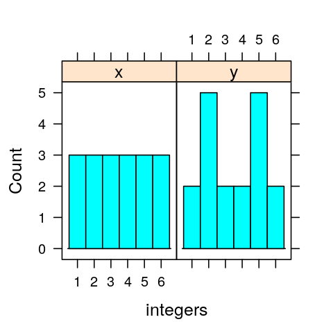

# Boxplot properties Q1

A boxplot can show whether a data set is:

A. symmetric
B. skewed
C. **symmetric and skewed (Correct)**

## Correct rationales


## Incorrect rationales


# Boxplot properties Q2

If one side of the box is longer than the other, it means that side contains more data.

A. TRUE
B. **FALSE (Correct)**

## Correct rationales


## Incorrect rationales


# Boxplot properties Q3

The figure below shows histograms from two different data sets, each one containing 18 values that vary from 1 to 6. The histogram on the left has an equal number of values in each group, and the one on the right has two peaks at 2 and 5. Which of the following statements is true?



A. The boxplots for each histogram will be different.
B. **The boxplots for each histogram will be the same (Correct)**
C. There is not enough information to tell us if the boxplots will be the same or if they will be different. 

## Correct rationales


## Incorrect rationales


# Question : Standard Deviations Q1

Researcher 1 takes a sample of 100 men age 18-24 in a certain town. In the same town, Researcher 2 takes a sample of 1000 men age 18-24. Which of the following statements is true?

A. The average height for the sample collected by Researcher 2 will be bigger than the average height for the sample collected by Researcher 1
B. The standard deviation of heights for the sample collected by Researcher 2 will be smaller than the standard deviation of heights for the sample collected by Researcher 1
C. The sample collected by Researcher 1 will likely contain the tallest of the 1,100 men.
D. **The sample collected by Researcher 2 will likely contain the shortest of the 1,100 men. (Correct)**

## Correct rationales


## Incorrect rationales


# Standard Deviations Q2

If you add 7 to each entry on a list of numbers (which contains both positive and negative integers), that adds 7 to the standard deviation. 

A. TRUE
B. **FALSE (Correct)**

## Correct rationales


## Incorrect rationales


# Normal Curves Q1

To completely specify the shape of a normal distribution, you must give:

A. the mean and standard deviation (Correct)
B. the five-number summary (min, Q1, median, Q3, max)
C. the mean and the median
D. the mean and the interquartile range


## Correct rationales


## Incorrect rationales


# Normal Curves Q2

Which of the following statements is false regarding normal curves?

A. the mean of a normal density curve shifts the curve along the horizontal axis without changing its shape 
B. increasing the standard deviation produces a flatter and wider bell-shaped curve and that decreasing the standard deviation produces a taller and narrower curve
C. area under a density curve over an interval represents the proportion of data that falls in that interval
D. **unlike the average, the standard deviation is not sensitive to outliers. (Correct)**


## Correct rationales


## Incorrect rationales


<!-- 
We support several options via the YAML header

- Setting a DOI or URL footer, for example for the CRAN package URL,
  which is placed in the bottom-left footer of the title page and even pages;
- Setting a footer label, for example _YourPackage Vignette_ stating
  your package, which is placed in the bottom-right footer on odd
  pages;
- Setting a free-form author field used on the inside footer;
- Optional _Draft_ watermarking;


## References 

Here we differ from PNAS and suggest natbib. References will appear in
author-year form. Use `\citet{}`, `\citep{}`, etc as usual.

We default to the `jss.bst` style. To switch to a different bibliography
style, please use `biblio-style: style` in the YAML header.


## Inline R Code 

The PNAS sample included a fixed PNG image here, but this document prefers
to show the results and embedding of _R_ code. 

```{r figex, fig.width=3, fig.height=3, cache=TRUE, echo=TRUE, fig.cap="Narrow ggplot2 figure"}
library(ggplot2)
ggplot(mtcars, aes(wt, mpg)) +
    geom_point(size=3, aes(colour=factor(cyl))) +
    theme(legend.position="none")
```

Here we use a standard knitr bloc with explicit options for

- figure width and height (`fig.width`, `fig.height`), both set to three inches;
- whether the code is shown (`echo=TRUE`); and
- the caption (`fig.cap`) as shown above.


## Digital Figures 

Markdown, Pandoc and LaTeX support `.eps` and `.pdf` files.

Figures and Tables should be labelled and referenced in the standard way
using the `\label{}` and `\ref{}` commands.

The R examples above show how to insert a column-wide
figure. To insert a figure wider than one column, please use the
`\begin{figure*}...\end{figure*}` environment. 

One (roundabout) way of doing this is to _not_ actually plot a figure, but to
save it in a file as the following segment shows:

```{r densityPlot, echo=TRUE}
library(ggplot2)
p <- ggplot(data = midwest,
            mapping = aes(x = area,
                          fill = state,
                          color = state)) +
    geom_density(alpha = 0.3)
## save to file
suppressMessages(ggsave("densities.pdf", p))
```

This file is then included via standard LaTeX commands.

\begin{figure*}
  \begin{center}
    \includegraphics[width=0.66\textwidth, height=3.5in]{densities} 
  \end{center}
  \caption{Wide ggplot2 figure}\label{fig}
\end{figure*}


## Typeset Code (But Do Not Run It) 

We can also just show code.

```r
xx <- faithful[,"eruptions"]
fit <- density(xx)
plot(fit)
```

This simply used a pandoc bloc started and ended by three backticks,
with `r` as the language choice.  Similarly, _many_ other languages
can be typeset directly simply by relying on pandoc.


## Single column equations 

Authors may use 1- or 2-column equations in their article, according to
their preference.

To allow an equation to span both columns, options are to use the
`\begin{figure*}...\end{figure*}` environment mentioned above for
figures, or to use the `\begin{widetext}...\end{widetext}` environment
as shown in equation \ref{eqn:example} below.

Please note that this option may run into problems with floats and
footnotes, as mentioned in the [cuted package
documentation](http://texdoc.net/pkg/cuted). In the case of problems
with footnotes, it may be possible to correct the situation using
commands `\footnotemark` and `\footnotetext`.

\begin{equation}
  \begin{aligned}
(x+y)^3&=(x+y)(x+y)^2\\
       &=(x+y)(x^2+2xy+y^2) \\
       &=x^3+3x^2y+3xy^3+x^3. 
       \label{eqn:example} 
  \end{aligned}
\end{equation}


pandoc writes all tables using longtable, which fails in 2-column mode

  Species                    CBS     CV     G3
  ----------------------- ------ ------ ------
  1\. Acetaldehyde           0.0    0.0    0.0
  2\. Vinyl alcohol          9.1    9.6   13.5
  3\. Hydroxyethylidene     50.8   51.2   54.0

  : Comparison of the fitted potential energy surfaces and ab initio
  benchmark electronic energy calculations

-->

