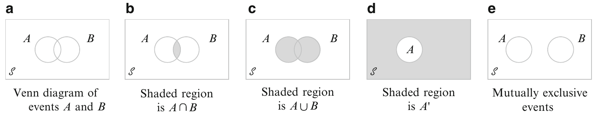
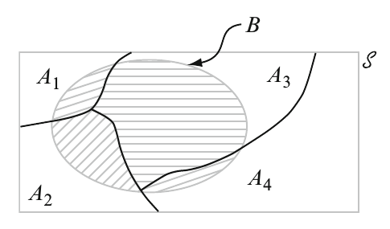
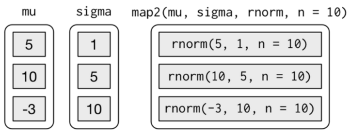

--- 
title: "EPIB 607"
author: "Sahir Bhatnagar and James Hanley"
date: "2018-08-24"
knit: bookdown::render_book
site: bookdown::bookdown_site
output: bookdown::gitbook
documentclass: book
bibliography: [bib/book.bib, bib/packages.bib]
biblio-style: apalike
link-citations: yes
github-repo: "sahirbhatnagar/EPIB607"
description: "Course material for EPIB 607 at McGill University"
url: 'https\://sahirbhatnagar.com/EPIB607'
---


# (PART) Preface {-}

# Welcome {-}

Welcome to the course notes for [EPIB 607: Inferential Statistics](https://www.mcgill.ca/study/2018-2019/courses/epib-607) at McGill University. 

## Objectives {-}

The aim of this course is to provide students with basic principles of statistical inference so that they can:  

1. Understand the statistical methods section in a scientific paper.  
2. Apply statistical methods in their own research.  
3. Use the methods learned in this course as a foundation for more advanced biostatistics courses.  

## Audience {-}

The principle audience is researchers in the natural and social sciences who have a basic understanding of differentiable and integral calculus, but haven't had an introductory course in statistics. This audience accepts that statistics has penetrated the life sciences pervasively and is required knowledge for both doing research and reading papers. 


## About these notes {-}

These notes are a collection of useful links, videos, online resources and papers. The instructors have found that no single book sufficiently teaches all the topics covered in this course. Instead, we direct the readers to what we think is a good learning resource for a given topic (following the **Flipped Classroom** strategy, see below). We also provide our own commentary and notes when we think its useful.  


## Teaching strategy {-}

This course will follow the **Flipped Classroom** model. Here, students are expected to have engaged with the material before coming to class (based on very precise pre-class instructions). The students will then be expected to answer a series of questions using the [DALITE](https://mydalite.org/en/live/signup/form/NTc4) online platform [@bhatnagar2016dalite].  

This allows the instructor to delegate the delivery of basic content and definitions to textbooks and videos, and enforces the idea that students cannot be simply passive recipients of information. This approach then allows the professor to focus valuable class time on nurturing efficient discussions surrounding the ideas within the content, guiding interactive
exploration of typical misconceptions, and promoting collaborative problem solving with peers. The following video gives a quick overview of the flipped classroom model.

<br>  

<center>
<iframe width="800" height="450" src="https://www.youtube.com/embed/qdKzSq_t8k8" frameborder="0" allow="autoplay; encrypted-media" allowfullscreen></iframe>
</center>


## A focus on computation {-}

The classic statistics textbooks were written during a time when computers were still in their infancy. As such, even the newer editions heavily rely on _by-hand_ computations such as looking up tables for tail probabilities. We take a modern approach and use the computer whenever possible to solve problems.  


## R Code Conventions {-}

We use [`R`](https://cran.r-project.org/) code throughout these notes. When `R` code is displayed[^1] it will be typeset using a `monospace` font with syntax highlighting enabled to ensure the differentiation of functions, variables, and so on. For example, the following adds 1 to 1

[^1]: https://raw.githubusercontent.com/coatless/spm/master/index.Rmd


```r
a = 1L + 1L
a
```

Each code segment may contain actual output from `R`. Such output will appear in grey font prefixed by `#>`. For example, the output of the above code segment would look like so:


```
#> [1] 2
```


##  Rendering Mathematical Formulae {-}

Throughout these notes, there will be mathematical symbols used to express the material. Depending on the version of the book, there are two different rendering engines.  

- For the online version, the text uses [MathJax](https://www.mathjax.org/) to render mathematical notation for the web. In the event the formulae does not load for a specific chapter, first try to refresh the page. 9 times out of 10 the issue is related to the software library not loading quickly.  
- For the pdf version, the text is built using the recommended AMS LaTeX symbolic packages. As a result, there should be no issue displaying equations. An example of a mathematical rendering capabilities would be given as[^1]:

\[ a^2 + b^2 = c^2 \]


## Development {-}

This book is built with [**bookdown**](https://github.com/rstudio/bookdown) and is open source and publicly available. This approach encourages contributions, ensures reproducibility and provides access to the material worldwide. The online version of the book is hosted at [sahirbhatnagar.com/EPIB607](https://sahirbhatnagar.com/EPIB607) and kept up-to-date thanks to [Travis](https://travis-ci.org/sahirbhatnagar/EPIB607). The entire source code is available at [https://github.com/sahirbhatnagar/EPIB607](https://github.com/sahirbhatnagar/EPIB607).  

If you notice any errors, we would be grateful if you would let us know by filing an issue [here](https://github.com/sahirbhatnagar/EPIB607/issues)
or making a pull request by clicking the edit button in the top-left corner of the text:


## Acknowledgements {-}


## License {-}

<a rel="license" href="http://creativecommons.org/licenses/by/4.0/"></a><br />This work is licensed under a <a rel="license" href="http://creativecommons.org/licenses/by/4.0/">Creative Commons Attribution 4.0 International License</a>


<!--
# won't work with pdf
[](https://travis-ci.org/sahirbhatnagar/MATH697)
-->

The version of the book you are reading now was built on 2018-08-24 and was built locally.

## General Information {-}

- Instructor(s): Sahir Bhatnagar 
- Email: [sahir.bhatnagar@mcgill.ca](mailto:sahir.bhatnagar@mcgill.ca), 
- Website: [http://sahirbhatnagar.com/EPIB607/](http://sahirbhatnagar.com/EPIB607/)
- Lectures: Tuesdays 9am - 12pm
- Office: TBD
- Office Hours: By appointment only
- Prerequisite(s): Calculus and Algebra
- Texts: _Modern Mathematical Statistics with Applications_, 2nd Edition by Jay L. Devore and Kenneth N. Berk

## Course Description {-}

The main learning outcomes of this course are to get a broad idea about some frequently used probability models and to learn basic results and techniques in probability theory and statistical inference. Most of the materials for the course will be drawn from the first seven chapters of the textbook. The book does not, however, contain all the materials we intend to cover in this course. Some extra notes will therefore be given on those topics not in the text book. We will also introduce computational methods in statistics with the statistical software program `R`.


## Grade Distribution  {-}


                  
------------  ----
Assignments   10% 
Quizzes       40% 
Final Exam    50% 
------------  ----

## Target Syllabus {-}

### Overview and Descriptive Statistics (Weeks 1-4)  {-}
- 1.1 Populations and Samples 


### Probability (Weeks 1-4)  {-}
- 2.1 Sample Spaces and Events
- 2.2 Axioms, Interpretations, and Properties of Probability
- 2.3 Counting Techniques 
- 2.4 Conditional Probability 
- 2.5 Independence

### Discrete Random Variables and Probability Distributions (Weeks 1-4)  {-}
  
- 3.1 Random Variables 
- 3.2 Probability Distributions for Discrete Random Variables 
- 3.3 Expected Values of Discrete Random Variables 
- 3.4 Moments and Moment Generating Functions 
- 3.5 The Bernoulli/Binomial Probability Distribution 
- 3.6 The Geometric/Negative Binomial Probability Distribution
- 3.7 The Poisson Probability Distribution 

### Continuous Random Variables and Probability Distributions (Weeks 5-8) {-}

- 4.1 Probability Density Functions and Cumulative Distribution Functions  
- 4.2 Expected Values and Moment Generating Functions  
- 4.3 The Uniform Distribution  
- 4.4 The Exponential Distribution  
- 4.5 The Gamma Distribution  
- 4.6 The Normal Distribution  
- 4.7  One-Dimensional Change of Variable (Discrete and Continuous)  


### Joint Probability Distributions (Weeks 5-8) {-}

- 5.1 Jointly Distributed Random Variables 
- 5.2 Expected Values, Covariance, and Correlation 
- 5.3 Conditional Distributions 
- 5.4 Multidimensional Change of Variable (Discrete and Continuous)  

### Sampling Distributions and Limits (Weeks 5-8) {-}

- 6.1 Sampling Distributions
- 6.2 Convergence in Probability, Weak Law of Large Numbers
- 6.3 Convergence with Probability 1, Strong Law of Large Numbers   
- 6.4 Convergence in Distribution, Central Limit Theorem  

### Statistical Inference (Weeks 9-12) {-}

- 7.1 Inference Using a Probability Model  
- 7.2 Statistical Models   
- 7.3 Data Collection (Finite Populations, Simple Random Sampling, Histograms)  
- 7.4 Basic Inferences (Descriptive, Plots, Types of Inferences)  

### Likelihood Inference (Weeks 9-12) {-}
- 8.1 The Likelihood Function, Sufficient Statistics  
- 8.2 Maximum Likelihood Estimation  
- 8.3 Inferences Based on the MLE (Standard Errors, Bias, Consistency, Confidence Intervals, Hypotheses and Test Procedures, P-values, Inferences for the Variance)  
- 8.4 Distribution-Free Methods (Method of Moments, Bootstrapping)  

### Regression and Correlation (Weeks 9-12) {-}

- 9.1 The Simple Linear and Logistic Regression Models  
- 9.2 Estimating Model Parameters   
- 9.3 Inferences About the Regression Coefficient   
- 9.4 Inferences Concerning Prediction of Future $Y$ Values  
- 9.5 Correlation  
- 9.6 Model Checking ($\chi^2$ Goodness of Fit Test, Cross-Validation)  
- 9.7 Multiple Regression Analysis  
- 9.8 Regression with Matrices  


# Prerequisites {-}

## Install R and RStudio  {-}

All examples in this book are run in an [R](https://cran.r-project.org/) environment. You also need a recent version of [RStudio](https://www.rstudio.com/products/rstudio/download/preview/), which is a software application that facilitates how you interact with `R`. It is developed by data enthusiasts who consider statistics to be more than just simulations, formulas and proofs. RStudio emphasizes the following: 

1. **Version control**:  [Why I should use version control](http://stackoverflow.com/questions/1408450/why-should-i-use-version-control) especially for the [solo data analyst](http://stackoverflow.com/questions/2712421/r-and-version-control-for-the-solo-data-analyst).

2. **Reproducible research**: seamless integration with [RMarkdown](http://rmarkdown.rstudio.com/) for creating [dynamic documents](http://yihui.name/knitr/) and presentations

3. **Creating R Packages**: seamless integration with the [devtools](https://github.com/hadley/devtools) package for creating software that implements your statistical method or analysis. 


## R Packages  {-}

The following packages will be called upon at some point, so please install them before getting started with the tutorials. Enter the following command in `R`:


```r
install.packages(c("pacman","knitr","data.table", "rmarkdown", "tidyverse", "boot", "Hmisc"))
```


## Introduction to R {-}

Try out the interactive tutorial: [http://swirlstats.com/](http://swirlstats.com/)


## Background Reading  {-}

The greatest thing about `R` is that there are so many people out there willing to help you. `R` users are constantly writing tutorials and creating packages to make your analysis tasks easier. Here is a very targeted list that I suggest reading prior to starting the tutorials

1. [Writing Functions](http://r4ds.had.co.nz/functions.html) 
2. [`for` loops](http://r4ds.had.co.nz/iteration.html)
3. [`apply` vs. `for`](https://kbroman.wordpress.com/2013/04/02/apply-vs-for/)


# Slides {-}

1. [Discrete Random Variables and Probability Distributions (part I)](https://github.com/sahirbhatnagar/MATH697/blob/master/images/week3.pdf)
2. [Discrete Random Variables and Probability Distributions (part II)](https://github.com/sahirbhatnagar/MATH697/blob/master/images/week4.pdf)
3. [Continuous Random Variables and Probability Distributions](https://github.com/sahirbhatnagar/MATH697/blob/master/images/week5.pdf)
4. [Normal Distribution and Expectations of Continuos Random Variables](https://github.com/sahirbhatnagar/MATH697/blob/master/images/week6.pdf)
5. [Transformations of a Random Variable and Discrete Joint Distributions](https://github.com/sahirbhatnagar/MATH697/blob/master/images/week7.pdf)
6. [Joint, Marginal, Conditional Continuous Distributions](https://github.com/sahirbhatnagar/MATH697/blob/master/images/week8.pdf)
7. [Multidimensional Change of Variables, Conditional Expectation, Variance, Hierarchical Distributions](https://github.com/sahirbhatnagar/MATH697/blob/master/images/week9.pdf)
8. [Sampling Distributions and Limits, Convergence in Probability](https://github.com/sahirbhatnagar/MATH697/blob/master/images/week10.pdf)
9. [Convergence in Distribution and Central Limit Theorem](https://github.com/sahirbhatnagar/MATH697/blob/master/images/week11.pdf)
10. [Maximum Likelihood Estimation](https://github.com/sahirbhatnagar/MATH697/blob/master/images/week12.pdf)
11. [A Primer on Linear Regression](https://github.com/sahirbhatnagar/MATH697/blob/master/images/week13.pdf)


# Assignments {-}

1. [A1 (due September 26, 2017)](https://github.com/sahirbhatnagar/MATH697/blob/master/images/HW-1-F2017.pdf)
2. [A2 (due October 12, 2017)](https://github.com/sahirbhatnagar/MATH697/blob/master/images/HW-2-F2017.pdf)
3. [A3 (due October 26, 2017)](https://github.com/sahirbhatnagar/MATH697/blob/master/images/HW-3-F2017.pdf)
4. [A4 (due November 9, 2017)](https://github.com/sahirbhatnagar/MATH697/blob/master/images/HW-4-F2017.pdf)

# Quiz {-}

1. [Quiz 1 (October 3, 2017)](https://github.com/sahirbhatnagar/MATH697/blob/master/images/quiz-1-F2017.pdf)
2. [Quiz 2 (November 7, 2017)](https://github.com/sahirbhatnagar/MATH697/blob/master/images/quiz-2-F2017.pdf)
3. [Quiz 2 (November 7, 2017)](https://github.com/sahirbhatnagar/MATH697/blob/master/images/quiz-3-F2017.pdf)


# R Code {-}

## Central Limit Theorem in Action

1. [clt-master.Rmd](https://github.com/sahirbhatnagar/MATH697/blob/master/images/clt-master.Rmd)   
2. [clt-template.Rmd](https://github.com/sahirbhatnagar/MATH697/blob/master/images/clt-template.Rmd) 

## IMPC Dataset

1. [impc_data.txt](https://github.com/sahirbhatnagar/MATH697/blob/master/images/impc_data.txt) 


# Distribution Tables {-}

## Standard Normal

1. [Standard Normal Table](https://github.com/sahirbhatnagar/MATH697/blob/master/images/Standard_Normal_Table.pdf)   

## t-Distribution

1. [t-Distribution Table](https://github.com/sahirbhatnagar/MATH697/blob/master/images/t_Table.pdf)   

<!--chapter:end:index.Rmd-->


# (PART) Part I {-} 


# Overview and Descriptive Statistics[^3] {#intro}

[^3]: Devore and Berk.

Statistical concepts and methods are not only useful but indeed often indispensable in understanding the world around us. They provide ways of gaining
new insights into the behavior of many phenomena that you will encounter in your chosen field of specialization.  

The discipline of statistics teaches us how to make intelligent judgments and informed decisions in the presence of _uncertainty and variation_. 

\BeginKnitrBlock{rmdimportant}<div class="rmdimportant">Without uncertainty or variation, there would be little need for statistical methods or statisticians. </div>\EndKnitrBlock{rmdimportant}

If the yield of a crop were the same in every field, if all individuals reacted the same way to a drug, if everyone gave the same response to an opinion survey, and so on, then a **single observation would reveal all desired information**.


## Populations and Samples

We are constantly exposed to collections of facts, or data, both in our professional capacities and in everyday activities. The discipline of statistics provides methods for organizing and summarizing data and for drawing conclusions based on information contained in the data.

An investigation will typically focus on a well-defined collection of objects constituting a population of interest:
- In one study, the population might consist of all gelatin capsules of a particular type produced during a specified period.
- Another investigation might involve the population consisting of all individuals who received a B.S. in mathematics during the most recent academic year.

When desired information is available for all objects in the population, we have what is called a census. Constraints on time, money, and other scarce resources usually make a census impractical or infeasible. Instead, a subset of the population, **a sample**, is selected in some prescribed manner. Thus we might obtain a sample of pills from a particular production run as a basis for investigating whether pills are conforming to manufacturing specifications, or we might select a sample of last year's graduates to obtain feedback about the quality of the curriculum.

### Variable

We are usually interested only in certain characteristics of the objects in a population: the amount of vitamin C in the pill, the gender of a mathematics
graduate, the age at which the individual graduated, and so on. A variable is any characteristic whose value may change from one object to another in the population. Can be categorical (male/female) or numerical (temperature). 


data type      description                                    
-------------  -----------------------------------------------
univariate     consists of observations on a single variable  
bivariate      observations are made on each of two variables 
multivariate   more than two variables                        


### Branches of Statistics

- **Descriptive Statistics**: summarize and describe important features of the data. Can be graphs (histograms, boxplots, and scatter plots), or numeric summaries (mean, standard deviations, and correlation coefficients)
- **Inferential Statistics**: Techniques for generalizing from a sample to a population. Having obtained a sample from a population, an investigator would frequently like to use sample information to draw some type of conclusion (make an inference of some sort) about the population. That is, the sample is a means to an end rather than an end in itself. 

\BeginKnitrBlock{rmdimportant}<div class="rmdimportant">The focus of this couse is Inferential statistics. But to get there we need to understand the basic concepts of probability</div>\EndKnitrBlock{rmdimportant}

The relationship between the two disciplines can be summarized by saying that probability reasons from the population to the sample (**deductive reasoning**), whereas inferential statistics reasons from the sample to the population (**inductive reasoning**).


Before we can understand what a particular sample can tell us about the population, we should first understand the uncertainty associated with taking a
sample from a given population. This is why we study probability before statistics.


\BeginKnitrBlock{example}\iffalse{-91-85-115-101-32-111-102-32-109-97-110-117-97-108-32-108-97-112-32-98-101-108-116-115-32-105-110-32-99-97-114-115-32-101-113-117-105-112-112-101-100-32-119-105-116-104-32-97-117-116-111-109-97-116-105-99-32-115-104-111-117-108-100-101-114-32-98-101-108-116-32-115-121-115-116-101-109-115-93-}\fi{}<div class="example"><span class="example" id="exm:unnamed-chunk-8"><strong>(\#exm:unnamed-chunk-8)  \iffalse (Use of manual lap belts in cars equipped with automatic shoulder belt systems) \fi{} </strong></span>_Probability_: assume that 50% of all drivers in a certain metropolitan area regularly use their lap belt $\rightarrow$ an assumption about the population. We might ask
- How likely is it that a sample of 100 such drivers will include at least 70 who regularly use their lap belt? 
- How many of the drivers in a sample of size 100 can we expect to regularly use their lap belt?  

_Inference_: a sample of 100 drivers of such cars revealed that 65 regularly use their lap belt. We might ask  
- Does this provide substantial evidence for concluding that more than 50% of all such drivers in this area regularly use their lap belt
We are attempting to use sample information to answer a question about the structure of the entire population from which the sample was selected.</div>\EndKnitrBlock{example}

## Pictorial and Tabular Methods in Descriptive Statistics


## Measures of Location


## Measures of Variability


<!--chapter:end:01-intro.Rmd-->


# Probability

## Introduction[^1] {-}

The random variation associated with _measurement_ procedures in a scientific analysis requires a framework in which the **uncertainty** and **variability** that are inherent in the procedure can be handled. The key goal of Probability and Statistical modelling is to establish a mathematical framework within which _random_ variation (due, for example, to experimental error or natural variation) can be quantified so that
_systematic_ variation (arising due to potentially important biological differences) can be studied.  

[^1]: Reproduced with permission from http://www.math.mcgill.ca/dstephens/


Broadly, the \textit{Scientific Process} involves several different stages:  

\begin{equation*}
\begin{array}{cl}
\text{{THEORETICAL MODELLING}} & \rightarrow \text{{MATHEMATICAL/PROBABILISTIC MODELLING}} \\
\downarrow &  \\
\text{{PREDICTION}} &  \\
\downarrow &  \\
\text{{EXPERIMENTATION/OBSERVATION}} &  \\
\downarrow &  \\
\text{{VALIDATION}} &
\end{array}
\end{equation*}  


_Mathematical/Probabilistic_ _modelling_ facilitates PREDICTION; _Statistical Analysis_ provides the means of validation
of predicted behaviour.  

To explain the variation in observed data, we need to introduce the concept of a _probability distribution_. Essentially we need
to be able to model, or specify, or compute the _chance_ of observing the data that we collect or expect to collect. This will then allow us to assess how likely the data were to occur by chance alone, that is, how _surprising_ the observed data are in light of an assumed theoretical model.

For example, consider two nucleotide sequences of the same length that we wish to assess for similarity:

\BeginKnitrBlock{example}\iffalse{-91-84-119-111-32-110-117-99-108-101-111-116-105-100-101-32-115-101-113-117-101-110-99-101-115-93-}\fi{}<div class="example"><span class="example" id="exm:unnamed-chunk-10"><strong>(\#exm:unnamed-chunk-10)  \iffalse (Two nucleotide sequences) \fi{} </strong></span>\begin{equation*}
\begin{array}{ll}
\text{{Sequence 1}}{\qquad } & ATAGTAGATACGCACCGAGGA \\
&  \\
\text{{Sequence 2}}{\qquad } & ATCTTAGATAGGCACTGAGGA
\end{array}
\end{equation*}

How can we assess sequence similarity formally ? The number of discordant positions is 4, but how informative is that summary measure ? Perhaps we need to assess the chance, for example, that a point mutation $$ A\rightarrow C $$ occurs (as in the discordant position 3) in unit evolutionary time. Perhaps the chance of observing a sub-sequence
\begin{equation*}
ATCTTA
\end{equation*}
rather than
\begin{equation*}
ATAGTA
\end{equation*}
(in positions 1-6) is important. 

- Is the hidden (or _latent_) structure in the sequence, corresponding to whether the sequence originates from a coding region or otherwise, important ? 
- Can we even infer the hidden structure in light of the data we have observed ?  
</div>\EndKnitrBlock{example}

These questions can only really be answered when we have an understanding of randomness and variation. The framework that we will use to pose and answer such questions formally is given to us by _probability theory_.  


### Probability: A Measure of Uncertainty[^2]  {-}

Often in life we are confronted by our own ignorance. Whether we are pondering tonight's traffic jam, tomorrow's weather, next week's stock prices, an upcoming election, or where we left our hat, often we do not know an outcome with certainty. Instead, we are forced to guess, to estimate, to hedge our bets. 

> Probability is the science of uncertainty. 

It provides precise mathematical rules for understanding and analyzing our own ignorance. It does not tell us tomorrow's weather
or next week's stock prices; rather, it gives us a **framework for working with our limited knowledge** and for **making sensible decisions based on what we do and do not know**.    

To say there is a 40% chance of rain tomorrow is not to know tomorrow’s weather. Rather, it is to **know what we do not know** about tomorrow's weather.
In this course, we will develop a more precise understanding of what it means to say there is a 40% chance of rain tomorrow. We will learn how to work with ideas of randomness, probability, expected value, prediction, estimation, etc., in ways that are sensible and mathematically clear.


[^2]: http://www.utstat.toronto.edu/mikevans/jeffrosenthal/book.pdf


## Sample Spaces and Events

### Sample Spaces

\BeginKnitrBlock{definition}\iffalse{-91-83-97-109-112-108-101-32-83-112-97-99-101-93-}\fi{}<div class="definition"><span class="definition" id="def:unnamed-chunk-11"><strong>(\#def:unnamed-chunk-11)  \iffalse (Sample Space) \fi{} </strong></span>The sample space $\Omega$ is the set of possible outcomes of an experiment. Points $\omega$ in $\Omega$ are called sample outcomes, realizations, or elements. </div>\EndKnitrBlock{definition}

\BeginKnitrBlock{example}\iffalse{-91-67-111-105-110-32-116-111-115-115-105-110-103-93-}\fi{}<div class="example"><span class="example" id="exm:unnamed-chunk-12"><strong>(\#exm:unnamed-chunk-12)  \iffalse (Coin tossing) \fi{} </strong></span>$\Omega = \left\lbrace  H, T  \right\rbrace$</div>\EndKnitrBlock{example}

\BeginKnitrBlock{example}\iffalse{-91-68-105-99-101-93-}\fi{}<div class="example"><span class="example" id="exm:unnamed-chunk-13"><strong>(\#exm:unnamed-chunk-13)  \iffalse (Dice) \fi{} </strong></span>$\Omega = \left\lbrace  1,2,3,4,5,6  \right\rbrace$</div>\EndKnitrBlock{example}

\BeginKnitrBlock{example}\iffalse{-91-80-114-111-112-111-114-116-105-111-110-115-93-}\fi{}<div class="example"><span class="example" id="exm:unnamed-chunk-14"><strong>(\#exm:unnamed-chunk-14)  \iffalse (Proportions) \fi{} </strong></span>$\Omega = \left\lbrace  x : 0 \leq x \leq 1  \right\rbrace$</div>\EndKnitrBlock{example}

\BeginKnitrBlock{example}\iffalse{-91-84-105-109-101-32-109-101-97-115-117-114-101-109-101-110-116-93-}\fi{}<div class="example"><span class="example" id="exm:unnamed-chunk-15"><strong>(\#exm:unnamed-chunk-15)  \iffalse (Time measurement) \fi{} </strong></span>$\Omega = \left\lbrace  x :  x > 0  \right\rbrace = {\mathbb{R}}^{+}$</div>\EndKnitrBlock{example}


\BeginKnitrBlock{example}\iffalse{-91-84-101-109-112-101-114-97-116-117-114-101-32-109-101-97-115-117-114-101-109-101-110-116-93-}\fi{}<div class="example"><span class="example" id="exm:unnamed-chunk-16"><strong>(\#exm:unnamed-chunk-16)  \iffalse (Temperature measurement) \fi{} </strong></span>$\Omega = \left\{ x:a\leq x\leq b\right\} \subseteq { \mathbb{R}}$</div>\EndKnitrBlock{example}


\BeginKnitrBlock{example}\iffalse{-91-66-105-111-108-111-103-105-99-97-108-32-83-101-113-117-101-110-99-101-32-65-110-97-108-121-115-105-115-93-}\fi{}<div class="example"><span class="example" id="exm:unnamed-chunk-17"><strong>(\#exm:unnamed-chunk-17)  \iffalse (Biological Sequence Analysis) \fi{} </strong></span>The experiment may involve the observation of a nucleotide or protein sequence, so that the sample space $\Omega$ may comprise all sequences (of bases/amino acids) up to a given length, and a sample outcome would be a particular observed sequence.</div>\EndKnitrBlock{example}

There are two basic types of experiment:
- Counting
- Measurement  

We shall see that these two types lead to two distinct ways of specifying probability distributions.

The collection of sample outcomes is a **set** (a collection of items) written as
\begin{equation*}
s\in \Omega
\end{equation*}
if $s$ _is a member of the set_ $\Omega$.

### Events

\BeginKnitrBlock{definition}\iffalse{-91-69-118-101-110-116-93-}\fi{}<div class="definition"><span class="definition" id="def:unnamed-chunk-18"><strong>(\#def:unnamed-chunk-18)  \iffalse (Event) \fi{} </strong></span>An event $E$ is a subset of the sample space $\Omega$ ($E \subseteq \Omega$). Events are usually denoted by upper case letters near the beginning of the alphabet, like $A, B, C$. An event which consists of only one outcome is called a simple (or elementary event); otherwise it is a compound event.</div>\EndKnitrBlock{definition}


\BeginKnitrBlock{rmdnote}<div class="rmdnote">The sets $\Omega$ and $E$ can be either be written as a list of items, for example,
\begin{equation*}
E=\left\{ s_{1},s_{2},...,s_{n},...\right\}
\end{equation*}
which may a finite or infinite list, or can only be represented by a continuum of outcomes, for example
\begin{equation*}
E=\left\{ x:0.6<x\leq 2.3\right\}
\end{equation*}</div>\EndKnitrBlock{rmdnote}


Events are manipulated using **set theory** notation; if $A$ and $B$ are two events, $A, B \subseteq \Omega$, then

- $A \cup B$ is the set of outcomes that belong to $A$ **or** to $B$, or to both,
- $A \cap B$ is the set of outcomes that belong to both $A$ **and** to $B$.
- $A^c$ (complement of $A$) is the set of outcomes **not** in $A$
- $A \backslash B = A \cap B^c$ 


The empty event will be denoted by $\varnothing$. Two events $A$ and $B$ are mutually exclusive if $A \cap B = \varnothing$, i.e., the collection of sample outcomes have no element in common. 





## Axioms, Interpretations, and Properties of Probability

\BeginKnitrBlock{definition}\iffalse{-91-65-120-105-111-109-115-32-40-98-97-115-105-99-32-112-114-111-112-101-114-116-105-101-115-41-32-111-102-32-80-114-111-98-97-98-105-108-105-116-121-93-}\fi{}<div class="definition"><span class="definition" id="def:unnamed-chunk-20"><strong>(\#def:unnamed-chunk-20)  \iffalse (Axioms (basic properties) of Probability) \fi{} </strong></span>To ensure that the probability assignments will be consistent with our intuitive notions of probability, all assign-
ments should satisfy the following axioms (basic properties) of probability  

- **AXIOM 1:** For any event $A$, \[ P(A) \geq 0 \]
- **AXIOM 2:** \[ P(\Omega) = 1 \]
- **AXIOM 3:** If $A_1, A_2, \ldots$ is an infinite collection of disjoint events, then
\[   P\left(A_1 \cup A_2 \cup \cdots \right) = \sum_{i=1}^{\infty} P(A_i)  \]
</div>\EndKnitrBlock{definition}


\BeginKnitrBlock{proposition}<div class="proposition"><span class="proposition" id="prp:unnamed-chunk-21"><strong>(\#prp:unnamed-chunk-21) </strong></span>$P(\varnothing) = 0$ where $\varnothing$ is the null event. This in turn implies that the property contained in Axiom 3 is valid for a finite collection of events.</div>\EndKnitrBlock{proposition}


\BeginKnitrBlock{proposition}<div class="proposition"><span class="proposition" id="prp:unnamed-chunk-22"><strong>(\#prp:unnamed-chunk-22) </strong></span>For any event $A$,  
\[ P(A) = 1 - P(A^c) \]</div>\EndKnitrBlock{proposition}


\BeginKnitrBlock{proposition}<div class="proposition"><span class="proposition" id="prp:unnamed-chunk-23"><strong>(\#prp:unnamed-chunk-23) </strong></span>For any event $A$,  
\[ P(A) \leq 1 \]</div>\EndKnitrBlock{proposition}


\BeginKnitrBlock{proposition}<div class="proposition"><span class="proposition" id="prp:unnamed-chunk-24"><strong>(\#prp:unnamed-chunk-24) </strong></span>For any events $A$ and $B$,   
\[ P(A \cup B) = P(A) + P(B) - P(A \cap B) \]</div>\EndKnitrBlock{proposition}


## Counting Techniques

When the various outcomes of an experiment are equally likely (the same probability is assigned to each simple event), the task of computing probabilities reduces to counting. In particular, if $N$ is the number of outcomes in a sample space and
$N(A)$ is the number of outcomes contained in an event $A$, then  \[ P(A) = \frac{N(A)}{N} \]


\BeginKnitrBlock{proposition}\iffalse{-91-80-114-111-100-117-99-116-32-114-117-108-101-32-102-111-114-32-111-114-100-101-114-101-100-32-112-97-105-114-115-93-}\fi{}<div class="proposition"><span class="proposition" id="prp:unnamed-chunk-25"><strong>(\#prp:unnamed-chunk-25)  \iffalse (Product rule for ordered pairs) \fi{} </strong></span>If the first element or object of an ordered pair can be selected in $n_1$ ways, and for each of these $n_1$ ways the second element of the pair can be selected in $n_2$ ways, then the number of pairs is $n_1 \cdot n_2$.</div>\EndKnitrBlock{proposition}

### Permutations

\BeginKnitrBlock{definition}\iffalse{-91-80-101-114-109-117-116-97-116-105-111-110-93-}\fi{}<div class="definition"><span class="definition" id="def:unnamed-chunk-26"><strong>(\#def:unnamed-chunk-26)  \iffalse (Permutation) \fi{} </strong></span>Any ordered sequence of $k$ objects taken from a set of $n$ distinct objects is called a permutation of size $k$ of the objects. The number of permutations of size $k$ that can be constructed from the $n$ objects is denoted by $P_k^n$:  

\[ P_k^n = \frac{n!}{(n-k)!} \]</div>\EndKnitrBlock{definition}


### Combinations

\BeginKnitrBlock{definition}\iffalse{-91-67-111-109-98-105-110-97-116-105-111-110-93-}\fi{}<div class="definition"><span class="definition" id="def:unnamed-chunk-27"><strong>(\#def:unnamed-chunk-27)  \iffalse (Combination) \fi{} </strong></span>Given a set of $n$ distinct objects, any unordered subset of size $k$ of the objects is called a combination. The number of combinations $n$ of size $k$ that can be formed from $n$ distinct objects will be denoted by  

\[ \binom{n}{k} = \frac{n!}{k!(n-k)!} = \frac{P_k^n}{k!} \]</div>\EndKnitrBlock{definition}


## Conditional Probability

Conditional probability is the means by which probabilities are updated in the light of new information. We examine how the information _an event B has occurred_ affects the probability assigned to $A$. 


\BeginKnitrBlock{example}\iffalse{-91-70-108-105-112-112-105-110-103-32-67-111-105-110-115-93-}\fi{}<div class="example"><span class="example" id="exm:flipcoins"><strong>(\#exm:flipcoins)  \iffalse (Flipping Coins) \fi{} </strong></span>We flip three different fair coins, and  
\[ \Omega = {H H H, H H T, H T H, H T T, T H H, T H T, T T H, T T T } \]
with $P(s) = 1/8$ for each $s \in \Omega$. What is the probability that the first coin comes up heads?  

\[ P(\textrm{first coin heads}) = P({H H H, H H T, H T H, H T T }) = 4/8 = 1/2 \]

But suppose now that an informant tells us that exactly two of the three coins came up heads. Now what is the probability that the first coin was heads? if we know that exactly two of the coins were heads, then we know
that the outcome was one of ${H H T , H T H, T H H}$.   

Because those three outcomes should (in this case) still all be equally likely, and because only the first two correspond
to the first coin being heads, we conclude the following: If we know that exactly two of the three coins are heads, then the probability that the first coin is heads is $2/3$.

More precisely, we have computed a conditional probability. That is, we have determined that, conditional on knowing that exactly two coins came up heads, the conditional probability of the first coin being heads is 2/3. We write this in mathematical notation as  

\[ P(\textrm{first coin heads} | \textrm{two coins heads}) = 2/3. \]

Here the vertical bar | stands for _conditional on_ or _given that_.</div>\EndKnitrBlock{example}


\BeginKnitrBlock{example}\iffalse{-91-65-115-115-101-109-98-108-121-32-76-105-110-101-115-93-}\fi{}<div class="example"><span class="example" id="exm:assembly"><strong>(\#exm:assembly)  \iffalse (Assembly Lines) \fi{} </strong></span>Complex components are assembled in a plant that uses two different assembly lines, $A$ and $A^c$ . Line $A$ uses older equipment than $A^c$, so it is somewhat slower and less reliable. $B$ are the defective components and $B^c$ are the nondefective.


|      | Condition |     |
|------|-----------|-----|
| **Line** | $B$         | $B^c$ |
| $A$    | 2         | 6   |
| $A^c$  | 1         | 9   |  

The sales manager randomly selects 1 of these 18 components for a demonstration  
\[ P(\textrm{line A component was selected}) = P(A) = \frac{N(A)}{N} = \frac{8}{18} = 0.444 \]

However, if the chosen component turns out to be defective, then the event $B$ has occurred, so the component must have been 1 of the 3 in the $B$ column of the table. Since these 3 components are equally likely among themselves after $B$ has occurred  

\[ P(\textrm{line A component was selected} | \textrm{Defective}) = \frac{2}{3} = \frac{2/18}{3/18} = \frac{P(A \cap B)}{P(B)} \]
</div>\EndKnitrBlock{example}

In Example \@ref(exm:assembly), the conditional probability is expressed as a ratio of **unconditional probabilities**. The numerator is the probability of the intersection of the two events, whereas the denominator is the probability of the conditioning event $B$. Given that $B$ has occurred, the relevant sample space is no longer $\Omega$ but consists of just outcomes in $B$; A has occurred if and only if _one of the outcomes in the intersection_ occurred, so the conditional probability of A given B is proportional to $P(A \cap B)$. The proportionality constant $1/P(B)$ is used to ensure that the probability $P(B | B)$ of the new sample space $B$ equals 1.


\BeginKnitrBlock{definition}\iffalse{-91-67-111-110-100-105-116-105-111-110-97-108-32-80-114-111-98-97-98-105-108-105-116-121-93-}\fi{}<div class="definition"><span class="definition" id="def:condprob"><strong>(\#def:condprob)  \iffalse (Conditional Probability) \fi{} </strong></span>Given two events $A$ and $B$, with $P(B) > 0$, the conditional probability of $A$ given $B$ is equal to  

\[ P(A|B) = \frac{P(A \cap B)}{P(B)}  \]
</div>\EndKnitrBlock{definition}


In example \@ref(exm:flipcoins), let  
- $A = {H H H, H H T, H T H, H T T }$ be the event that the first coin is heads  
- $B = {H H T, H T H, T H H}$ be the event that exactly two coins were heads  

It follows that  

\[ A \cap B = {H H T, H T H}\]

Therefore  

\[ P(A|B) = \frac{P(A \cap B)}{P(B)} = \frac{P({H H T, H T H})}{P({H H T, H T H, T H H})} = \frac{2/8}{3/8} = \frac{2}{3}\]


\BeginKnitrBlock{example}\iffalse{-91-66-97-108-97-110-99-101-100-32-100-105-101-93-}\fi{}<div class="example"><span class="example" id="exm:unnamed-chunk-28"><strong>(\#exm:unnamed-chunk-28)  \iffalse (Balanced die) \fi{} </strong></span>Suppose a balanced die is tossed in the next room. We are told that a number less than 4 was observed. What is the probability the number was either 1 or 2?
</div>\EndKnitrBlock{example}


\BeginKnitrBlock{example}\iffalse{-91-84-119-111-32-66-97-108-97-110-99-101-100-32-68-105-99-101-32-118-49-93-}\fi{}<div class="example"><span class="example" id="exm:unnamed-chunk-29"><strong>(\#exm:unnamed-chunk-29)  \iffalse (Two Balanced Dice v1) \fi{} </strong></span>Toss two balanced dice. Let $A$ = {sum of 5} and $B$ = {first die is $\leq$ 2}. Find $P(A|B)$  
</div>\EndKnitrBlock{example}


\BeginKnitrBlock{example}\iffalse{-91-84-119-111-32-66-97-108-97-110-99-101-100-32-68-105-99-101-32-118-50-93-}\fi{}<div class="example"><span class="example" id="exm:unnamed-chunk-30"><strong>(\#exm:unnamed-chunk-30)  \iffalse (Two Balanced Dice v2) \fi{} </strong></span>Two balanced dice are tossed. What is the probability that the first die gives a number less than three, given that the sum is odd?  
</div>\EndKnitrBlock{example}


\BeginKnitrBlock{example}\iffalse{-91-85-110-98-97-108-97-110-99-101-100-32-68-105-101-93-}\fi{}<div class="example"><span class="example" id="exm:unbalanced"><strong>(\#exm:unbalanced)  \iffalse (Unbalanced Die) \fi{} </strong></span>Toss an unbalanced die with probs $P(1)=.1$, $P(2)=.1$, $P(3)=.3$, $P(4)=.2$, $P(5)=.1$, $P(6)=.2$. Let $A={\geq 5}$ and $B={\geq 2}$. Find $P(A|B)$.  
</div>\EndKnitrBlock{example}


\BeginKnitrBlock{example}\iffalse{-91-84-119-111-32-66-97-108-97-110-99-101-100-32-67-111-105-110-115-93-}\fi{}<div class="example"><span class="example" id="exm:unnamed-chunk-31"><strong>(\#exm:unnamed-chunk-31)  \iffalse (Two Balanced Coins) \fi{} </strong></span>Two balanced coins were tossed, and it is known that at least one was a head. What is the probability that both were heads?  
</div>\EndKnitrBlock{example}


\BeginKnitrBlock{example}\iffalse{-91-84-119-111-32-67-97-114-100-115-93-}\fi{}<div class="example"><span class="example" id="exm:unnamed-chunk-32"><strong>(\#exm:unnamed-chunk-32)  \iffalse (Two Cards) \fi{} </strong></span>Two cards are drawn without replacement from a standard deck. Find the probability that  

1) the second is an ace, given that the first is not an ace.  
2) the second is an ace.  
3) the first was an ace, given that the second is an ace.  

</div>\EndKnitrBlock{example}


\BeginKnitrBlock{example}\iffalse{-91-78-117-109-98-101-114-115-32-105-110-32-97-32-72-97-116-93-}\fi{}<div class="example"><span class="example" id="exm:unnamed-chunk-33"><strong>(\#exm:unnamed-chunk-33)  \iffalse (Numbers in a Hat) \fi{} </strong></span>The numbers 1 to 5 are written on five slips of paper and placed in a hat. Two slips are drawn at random without replacement. What is the probability that the first number is 3, given a sum of seven?  
</div>\EndKnitrBlock{example}


\BeginKnitrBlock{example}\iffalse{-91-79-110-101-32-67-97-114-100-93-}\fi{}<div class="example"><span class="example" id="exm:unnamed-chunk-34"><strong>(\#exm:unnamed-chunk-34)  \iffalse (One Card) \fi{} </strong></span>A card is selected at random (i.e. every card has the same probability of being chosen) from a deck of 52. What is the probability it is a red card or a face card?  
</div>\EndKnitrBlock{example}


Definition \@ref(def:condprob) immediately leads to the _multiplication formula_  

\BeginKnitrBlock{definition}\iffalse{-91-77-117-108-116-105-112-108-105-99-97-116-105-118-101-32-82-117-108-101-93-}\fi{}<div class="definition"><span class="definition" id="def:multformula"><strong>(\#def:multformula)  \iffalse (Multiplicative Rule) \fi{} </strong></span>\[P(A \cap B) = P(A|B) P(B)\]

and  

\[P(A \cap B) = P(B|A) P(A)\]
</div>\EndKnitrBlock{definition}

This allows us to compute the joint probability of $A$ and $B$ when we are given the probability of $B$ and the conditional probability of $A$ given $B$, and vice versa.  


\BeginKnitrBlock{example}\iffalse{-91-70-105-115-104-32-105-110-32-97-32-84-97-110-107-93-}\fi{}<div class="example"><span class="example" id="exm:unnamed-chunk-35"><strong>(\#exm:unnamed-chunk-35)  \iffalse (Fish in a Tank) \fi{} </strong></span>A tank has three red fish and two blue fish. Two fish are chosen at random and without replacement. What is the probability of getting  

1) red fish first and then a blue fish?  
2) both fish red?  
3) one red fish and one blue fish?  


</div>\EndKnitrBlock{example}


### Law of Total Probability

Recall that events $A_1, A_2, \ldots, A_k$ are mutually exclusive if no two have any common outcomes. The events are exhaustive if one $A_i$ must occure, so that  
\[A_1 \cup A_2 \cup \cdots \cup A_k = \Omega \]

\BeginKnitrBlock{theorem}\iffalse{-91-76-97-119-32-111-102-32-84-111-116-97-108-32-80-114-111-98-97-98-105-108-105-116-121-93-}\fi{}<div class="theorem"><span class="theorem" id="thm:totprob"><strong>(\#thm:totprob)  \iffalse (Law of Total Probability) \fi{} </strong></span>Let $A_1, A_2, \ldots, A_k$ be mutually exclusive and exhaustive events. Then for any other event $B$,   
\[P(B) = P(B|A_1) P(A_1) + \cdots + P(B|A_k)P(A_k) = \sum_{i=1}^{k} P(B|A_i) P(A_i)\]</div>\EndKnitrBlock{theorem}

**Proof**:  Because the $A_i$'s are mutually exclusive and exhaustive, if $B$ occurs it must be in conjunction with exactly one of the $A_i$'s. That is, $B= (A_1\textrm{ and }B)$ or $\ldots$ or $(A_k\textrm{ and }B)$ which is equal to $(A_1 \cap B) \cup \cdots \cup (A_k \cap B)$, where the events $(A_i \cap  B)$ are mutually exclusive.



Thus we have 

\[P(B) =\sum_{i=1}^{k} P(A_i \cap B) = \sum_{i=1}^{k} P(B|A_i) P(A_i) \]

\BeginKnitrBlock{example}\iffalse{-91-76-111-110-103-32-72-97-105-114-93-}\fi{}<div class="example"><span class="example" id="exm:unnamed-chunk-36"><strong>(\#exm:unnamed-chunk-36)  \iffalse (Long Hair) \fi{} </strong></span>Suppose a class contains 60% girls and 40% boys. Suppose that 30% of the girls have long hair, and 20% of the boys have long hair. A student is chosen uniformly at random from the class. What is the probability that the chosen student will have long hair?</div>\EndKnitrBlock{example}


### Bayes' Rule

\BeginKnitrBlock{theorem}\iffalse{-91-66-97-121-101-115-39-32-82-117-108-101-93-}\fi{}<div class="theorem"><span class="theorem" id="thm:bayesdef"><strong>(\#thm:bayesdef)  \iffalse (Bayes' Rule) \fi{} </strong></span>Let $A_1, \ldots, A_k$ be a collection of mutually exclusive and exhaustive events with $P(A_i) > 0$ for $i=1, \ldots, k$. Then for any other event B, for which $P(B)>0$, we have  

\[ P(A_j | B) = \frac{P(A_j \cap B)}{P(B)} = \frac{P(B|A_j) P(A_j)}{\sum_{i=1}^k P(B|A_i) P(A_i)}, \quad j=1, \ldots, k   \]  
</div>\EndKnitrBlock{theorem}

The transition from the second to the third expression in Theorem \@ref(thm:bayesdef) rests on using the multiplication rule in the numerator and the law of total probability in the denominator.


\BeginKnitrBlock{example}\iffalse{-91-85-114-110-115-93-}\fi{}<div class="example"><span class="example" id="exm:unnamed-chunk-37"><strong>(\#exm:unnamed-chunk-37)  \iffalse (Urns) \fi{} </strong></span>Suppose urn #1 has 3 red and 2 blue balls, and urn #2 has 4 red and 7 blue balls. Suppose one of the two urns is selected with probability $1/2$ each, and then one of the balls within that urn is picked uniformly at random.  

1) What is the probability that urn #2 is selected at the first stage (event A) and a blue ball is selected at the second stage (event B)?  
2) Compute the probability that a blue ball is obtained.  
3) Now suppose we are given the information that the ball picked is blue. What is probability that we had selected urn #2?  

</div>\EndKnitrBlock{example}


\BeginKnitrBlock{example}\iffalse{-91-76-97-114-103-101-32-66-114-105-100-103-101-115-93-}\fi{}<div class="example"><span class="example" id="exm:unnamed-chunk-38"><strong>(\#exm:unnamed-chunk-38)  \iffalse (Large Bridges) \fi{} </strong></span>There are three Canadian firms which build large bridges, firm 1, firm 2, and firm 3. 20% of Canadian large bridges have been built by firm 1, 30% by firm 2, and the rest by firm 3. 5% of the bridges built by firm 1 have collapsed, while 10% of those by firm 2 have collapsed, and 30% by firm 3 have collapsed.  

1) What is the probability that a bridge collapses?  
2) Suppose it is reported in tomorrow's newspaper that a large bridge has collapsed. What is the probability it was built by firm 1?   


</div>\EndKnitrBlock{example}


## Independence

If we flip a fair coin twice, then the probability of two heads is $1/2 \times 1/2$. We multiply the probabilities because we regard the two tosses as independent. The formal definition of independence is as follows:

\BeginKnitrBlock{definition}\iffalse{-91-73-110-100-101-112-101-110-116-32-69-118-101-110-116-115-93-}\fi{}<div class="definition"><span class="definition" id="def:indep"><strong>(\#def:indep)  \iffalse (Indepent Events) \fi{} </strong></span>Two events $A$ and $B$ are independent if  
\[ P(A \cap B) = P(A) P(B) \]</div>\EndKnitrBlock{definition}

Now, because $P(A | B) = P( A \cap B)/P(B)$, we see that $A$ and $B$ are independent if and only if $P(A | B) = P(A)$ or $P(B | A) = P(B)$, provided that $P(A) > 0$ and $P(B) > 0$. Definition \@ref(def:indep) has the advantage that it remains valid even if $P(B) = 0$ or $P(A) = 0$, respectively. Intuitively, events $A$ and $B$ are independent if neither one
has any impact on the probability of the other.

\BeginKnitrBlock{example}\iffalse{-91-84-111-115-115-32-97-32-102-97-105-114-32-99-111-105-110-32-49-48-32-116-105-109-101-115-93-}\fi{}<div class="example"><span class="example" id="exm:unnamed-chunk-39"><strong>(\#exm:unnamed-chunk-39)  \iffalse (Toss a fair coin 10 times) \fi{} </strong></span>Toss a fair coin 10 times. Let $A = {\textrm{at least one head}}$. Let $T_j$ be the event that tails occurs on the $j^{th}$ toss. Find $P(A)$  
</div>\EndKnitrBlock{example}


\BeginKnitrBlock{example}\iffalse{-91-85-110-98-97-108-97-110-99-101-32-68-105-101-32-82-101-118-105-115-105-116-101-100-93-}\fi{}<div class="example"><span class="example" id="exm:unnamed-chunk-40"><strong>(\#exm:unnamed-chunk-40)  \iffalse (Unbalance Die Revisited) \fi{} </strong></span>In Example \@ref(exm:unbalanced), if $A$ is the event that the die was 5, and $B$ is the event that the coin was tails, then calculate $P(A), P(B)$ and $P(A\cap B)$  
</div>\EndKnitrBlock{example}


<!--chapter:end:02-probability.Rmd-->


# Discrete Random Variables and Probability Distributions

## Introduction {-}

In Chapter [2][Probability], we discussed the probability model as the central object of study in the theory of probability. This required defining a probability measure $P$ on a class of subsets of the sample space $\Omega$. For
example, for an experiment with possible sample outcomes denoted by the \emph{sample space} $\Omega$, an \emph{event} $E$ was defined as any collection of sample outcomes, that is, any subset of the set $\Omega$.  

\[
\begin{array}{ccll}
\text{EXPERIMENT} & \longrightarrow \text{SAMPLE OUTCOMES} & \longrightarrow
\text{EVENTS} & \longrightarrow \text{PROBABILITIES} \\
& \Omega=\left\{ s_{1},s_{2},...\right\} & \longrightarrow E\subseteq S &
\longrightarrow P(E)
\end{array}
\]

In this framework, it is necessary to consider each experiment with its associated sample space separately - the nature of sample space $\Omega$ is typically different for different experiments.  
 
<br>
 
\BeginKnitrBlock{example}\iffalse{-91-82-97-105-110-121-32-100-97-121-115-93-}\fi{}<div class="example"><span class="example" id="exm:unnamed-chunk-42"><strong>(\#exm:unnamed-chunk-42)  \iffalse (Rainy days) \fi{} </strong></span>Count the number of days in February which have zero precipitation.  

\[ \Omega = \left\{ 0,1,2,\ldots,28\right\} \]  

Let $E_{i}$ = $i$ days have zero precipitation. $E_{0},\ldots,E_{28}$ partition $\Omega$.  
</div>\EndKnitrBlock{example}

<br><br>


\BeginKnitrBlock{example}\iffalse{-91-70-111-111-116-98-97-108-32-77-97-116-99-104-93-}\fi{}<div class="example"><span class="example" id="exm:unnamed-chunk-43"><strong>(\#exm:unnamed-chunk-43)  \iffalse (Footbal Match) \fi{} </strong></span>Count the number of goals in a football match.  

\[ \Omega = \left\{ 0,1,2,3,\ldots \right\} \]  

Let $E_{i}$ = $i$ goals in the match. $E_{0},E_{1},E_{2},\ldots$ partition $\Omega$  
  </div>\EndKnitrBlock{example}

<br>

\BeginKnitrBlock{rmdnote}<div class="rmdnote">In both of these examples, we need a formula to specify each   

\[ P(E_{i}) = p_{i} \]

</div>\EndKnitrBlock{rmdnote}


<br>

\BeginKnitrBlock{example}\iffalse{-91-79-112-101-114-97-116-105-110-103-32-84-101-109-112-101-114-97-116-117-114-101-93-}\fi{}<div class="example"><span class="example" id="exm:unnamed-chunk-45"><strong>(\#exm:unnamed-chunk-45)  \iffalse (Operating Temperature) \fi{} </strong></span>Measure the operating temperature of an experimental process.  

\[ \Omega = \left\{ x: x > T_{min} \right\} \]
</div>\EndKnitrBlock{example}

Here it is difficult to express 

\[ P(``\textrm{Measurement is }x") \]  

but possible to think about

\[ P (``\textrm{Measurement is }\leq x")=F(x) \]

and now we seek a formula for $F(x)$ which is a simpler way of presenting a particular probability assignment.

<br><br>

This chapter is concerned with the definitions of random variables, distribution functions $F(x)$, probability/density functions $f(x)$, and the development of the concepts necessary for carrying out calculations for a probability model using these entities [@evans2004probability].

The concept of a random variable allows us to pass from the experimental outcomes themselves to a numerical function of the outcomes. There are two fundamentally different types of random variables [@devore2011modern]:  

i) discrete random variables  
ii) continuous random variables  

In this chapter, we examine the basic properties and discuss the most important examples of **discrete** variables. Chapter [4][Continuous Variables and Probability Distributions] focuses on continuous random variables.  


## Random Variables

A general notation useful for all such examples can be obtained by considering a sample space that is **equivalent**
to $\Omega$ for a general experiment, but whose form is more familiar. 


\BeginKnitrBlock{definition}\iffalse{-91-82-97-110-100-111-109-32-86-97-114-105-97-98-108-101-93-}\fi{}<div class="definition"><span class="definition" id="def:rv"><strong>(\#def:rv)  \iffalse (Random Variable) \fi{} </strong></span>A random variable $X$ on $\Omega$ is a function from the sample space $\Omega$ to the set $\mathbb{R}$ of all real numbers denoted by 

\[ X : \Omega \rightarrow \mathbb{R}  \]

Let $R_X$ denote the range of $X$. 
</div>\EndKnitrBlock{definition}

<br>


$X$ is called a _discrete_ random variable if $R_X$ is a countable set. 


<br>


\BeginKnitrBlock{rmdnote}<div class="rmdnote">Random variables are customarily denoted by uppercase letters, such as $X$ and $Y$, lowercase letters to represent
some particular value of the corresponding random variable. The notation $X(s) = x$ means that $x$ is the value associated with the outcome $s$ by the rv $X$.  

</div>\EndKnitrBlock{rmdnote}


<br><br>


\BeginKnitrBlock{example}\iffalse{-91-67-111-105-110-32-84-111-115-115-93-}\fi{}<div class="example"><span class="example" id="exm:unnamed-chunk-47"><strong>(\#exm:unnamed-chunk-47)  \iffalse (Coin Toss) \fi{} </strong></span>Suppose a coin is tossed three times. Let $X$ be the number of heads observed. The sample space is 

\[ \Omega = \left\lbrace \underbrace{HHT}_{3},\underbrace{HHT}_{2},\underbrace{HTH}_{2},\underbrace{HTT}_{1}, \underbrace{THH}_{2}, \underbrace{THT}_{1}, \underbrace{TTH}_{1}, \underbrace{TTT}_{0} \right\rbrace   \]

That is, we have $X(HHH) = 3$, $X(HHT) = 2$, $X(HTH) = 2$, and so on. Hence $R_X = \left\lbrace 0,1,2,3 \right\rbrace$</div>\EndKnitrBlock{example}


<br><br>


\BeginKnitrBlock{example}\iffalse{-91-65-32-86-101-114-121-32-83-105-109-112-108-101-32-82-97-110-100-111-109-32-86-97-114-105-97-98-108-101-93-}\fi{}<div class="example"><span class="example" id="exm:simple"><strong>(\#exm:simple)  \iffalse (A Very Simple Random Variable) \fi{} </strong></span>Let the random variable $X: \left\lbrace \textrm{rain, snow, clear} \right\rbrace \rightarrow \mathbb{R}$ by 
$X(rain) = 3$, $X(snow) = 6$, and $X(clear) = -2.7$. </div>\EndKnitrBlock{example}

<br>

We now present several further examples. The point is, we can define random variables any way we like, as long as they are functions from the sample space to $\mathbb{R}$.

<br>


\BeginKnitrBlock{example}\iffalse{-91-65-32-86-101-114-121-32-83-105-109-112-108-101-32-82-97-110-100-111-109-32-86-97-114-105-97-98-108-101-32-50-93-}\fi{}<div class="example"><span class="example" id="exm:unnamed-chunk-48"><strong>(\#exm:unnamed-chunk-48)  \iffalse (A Very Simple Random Variable 2) \fi{} </strong></span>For the case $\Omega = \left\lbrace \textrm{rain, snow, clear} \right\rbrace$, we might define a second random variable $Y$ by saying that $Y = 0$ if it rains, $Y = -1/2$ if it snows, and $Y = 7/8$ if it is clear. That is $Y(rain) = 0$, $Y(snow) = 1/2$, and $Y(rain) = 7/8$.  

</div>\EndKnitrBlock{example}


<br><br>


\BeginKnitrBlock{example}\iffalse{-91-65-32-86-101-114-121-32-83-105-109-112-108-101-32-82-97-110-100-111-109-32-86-97-114-105-97-98-108-101-32-51-93-}\fi{}<div class="example"><span class="example" id="exm:unnamed-chunk-49"><strong>(\#exm:unnamed-chunk-49)  \iffalse (A Very Simple Random Variable 3) \fi{} </strong></span>If the sample space corresponds to flipping three different coins, then we could let $X$ be the total number of heads showing, let $Y$ be the total number of tails showing, let $Z = 0$ if there is exactly one head, and otherwise $Z = 17$.  

</div>\EndKnitrBlock{example}


<br><br>


\BeginKnitrBlock{example}\iffalse{-91-67-111-110-115-116-97-110-116-115-32-97-115-32-82-97-110-100-111-109-32-86-97-114-105-97-98-108-101-115-93-}\fi{}<div class="example"><span class="example" id="exm:unnamed-chunk-50"><strong>(\#exm:unnamed-chunk-50)  \iffalse (Constants as Random Variables) \fi{} </strong></span>As a special case, every constant value $c$ is also a random variable, by saying that $c(s) = c$ for all $s \in \Omega$. Thus, 5 is a random variable, as is 3 or −21.6.   

</div>\EndKnitrBlock{example}


<br><br>


\BeginKnitrBlock{example}\iffalse{-91-73-110-100-105-99-97-116-111-114-32-70-117-110-99-116-105-111-110-115-93-}\fi{}<div class="example"><span class="example" id="exm:unnamed-chunk-51"><strong>(\#exm:unnamed-chunk-51)  \iffalse (Indicator Functions) \fi{} </strong></span>If $A$ is any event, then we can define the indicator function of $A$, written $I_A$, to be the random variable

\[I_A(s)  = \begin{cases} 1 & s \in A \\ 0 & s \notin A   \end{cases} \]

</div>\EndKnitrBlock{example}


<br><br>


Suppose $X$ is a random variable. We know that different states $s$ occur with different probabilities. It follows that $X(s)$ also takes different values with different probabilities. These probabilities are called the **distribution** of $X$; we consider them next.


## Probability Distributions for Discrete Random Variables


Because random variables are defined to be functions of the outcome $s$, and because the outcome $s$ is assumed to be random (i.e., to take on different values with different probabilities), it follows that the value of a random variable will itself be random (as the name implies).  


Specifically, if $X$ is a random variable, then what is the probability that $X$ will equal some particular value $x$? Well, $X = x$ precisely when the outcome $s$ is chosen such that $X(s) = x$.


## Expected Values of Discrete Random Variables


## Moments and Moment Generating Functions


## The Binomial Probability Distribution


## The Poisson Probability Distribution

<!--chapter:end:03-discrete.Rmd-->


# Continuous Variables and Probability Distributions

## Introduction {-}

<!--chapter:end:04-continuous.Rmd-->


# (APPENDIX) R Tutorial {-} 

# Vectorization, *apply and for loops

This section will cover the basics of vectorizations, the `*apply` family of functions and `for` loops.


## Vectorization

Almost everything in `R` is a vector. A scalar is really a vector of length 1 and a `data.frame` is a collection of vectors. An nice feature of \texttt{R} is its vectorized capabilities. Vectorization indicates that a function operates on a whole vector of values at the same time and not just on a single value^[[http://www.dummies.com/how-to/content/how-to-vectorize-your-functions-in-r.html](http://www.dummies.com/how-to/content/how-to-vectorize-your-functions-in-r.html)]. If you have have ever taken a basic linear algebra course, this concept will be familiar to you.
\newline 
\vspace{0.1in}
Take for example two vectors: 
\newline
\vspace{0.1in}
$$
\begin{bmatrix} 1 \\ 2 \\ 3 \end{bmatrix} + 
\begin{bmatrix} 1 \\ 2 \\ 3 \end{bmatrix} =
\begin{bmatrix} 2 \\ 4 \\ 6 \end{bmatrix}
$$
\newline 
\vspace{0.1in}
The corresponding `R` code is given by:

```r
a <- c(1,2,3)
b <- c(1,2,3)
a+b
#> [1] 2 4 6
```

Many of the `base` functions in `R` are already vectorized. Here are some common examples:


```r

# generate a sequence of numbers from 1 to 10
(a <- 1:10)
#>  [1]  1  2  3  4  5  6  7  8  9 10

# sum the numbers from 1 to 10
sum(a)
#> [1] 55

# calculate sums of each column
colSums(iris[, -5])
#> Sepal.Length  Sepal.Width Petal.Length  Petal.Width 
#>        876.5        458.6        563.7        179.9
```


> **Exercise**: What happens when you sum two vectors of different lengths?

## Family of `*apply` functions

- `apply`, `lapply` and `sapply` are some of the most commonly used class of functions in `R`
- `*apply` functions are not necessarily faster than loops, but can be easier to read (and vice cersa)
- `apply` is used when you need to perform an operation on every row or column of a matrix or data.frame
- `lapply` and `sapply` differ in the format of the output. The former returns a list while the ladder returns a vector
- There are other `*apply` functions such as `tapply`, `vapply` and `mapply` with similar functionality and purpose


### Loops vs. Apply


```r

# Getting the row means of two columns
# Generate data
N <- 10000
x1 <- runif(N)
x2 <- runif(N)
d <- as.data.frame(cbind(x1, x2))
head(d)
#>        x1     x2
#> 1 0.57632 0.9615
#> 2 0.56474 0.1950
#> 3 0.07399 0.3001
#> 4 0.45387 0.3823
#> 5 0.37328 0.1197
#> 6 0.33132 0.9891

# Loop:
# create a vector to store the results in 
rowMeanFor <- vector("double", N)

for (i in seq_len(N)) {
        rowMeanFor[[i]] <- mean(c(d[i, 1], d[i, 2]))
}

# Apply:
rowMeanApply <- apply(d, 1, mean)

# are the results equal
all.equal(rowMeanFor,rowMeanApply)
#> [1] TRUE
```


### Descriptive Statistics using `*apply`


```r
data(women)
# data structure
str(women)
#> 'data.frame':	15 obs. of  2 variables:
#>  $ height: num  58 59 60 61 62 63 64 65 66 67 ...
#>  $ weight: num  115 117 120 123 126 129 132 135 139 142 ...

# calculate the mean for each column
apply(women, 2, mean)
#> height weight 
#>   65.0  136.7

# apply 'fivenum' function to each column
vapply(women, fivenum, c("Min." = 0, "1st Qu." = 0, "Median" = 0, 
                         "3rd Qu." = 0, "Max." = 0))
#>         height weight
#> Min.      58.0  115.0
#> 1st Qu.   61.5  124.5
#> Median    65.0  135.0
#> 3rd Qu.   68.5  148.0
#> Max.      72.0  164.0
```


### Creating new columns using `sapply`

You can apply a _user defined function_ to columns or the entire data frame:


```r
# the ouput of sapply is a vector
# the 's' in sapply stands for 'simplified' apply
mtcars$gear2 <- sapply(mtcars$gear, 
                       function(i) if (i==4) "alot" else "some")

head(mtcars)[,c("gear","gear2")]
#>                   gear gear2
#> Mazda RX4            4  alot
#> Mazda RX4 Wag        4  alot
#> Datsun 710           4  alot
#> Hornet 4 Drive       3  some
#> Hornet Sportabout    3  some
#> Valiant              3  some
```


### Applying functions to subsets using `tapply`


```r

# Fisher's famous dataset 
data(iris)
str(iris)
#> 'data.frame':	150 obs. of  5 variables:
#>  $ Sepal.Length: num  5.1 4.9 4.7 4.6 5 5.4 4.6 5 4.4 4.9 ...
#>  $ Sepal.Width : num  3.5 3 3.2 3.1 3.6 3.9 3.4 3.4 2.9 3.1 ...
#>  $ Petal.Length: num  1.4 1.4 1.3 1.5 1.4 1.7 1.4 1.5 1.4 1.5 ...
#>  $ Petal.Width : num  0.2 0.2 0.2 0.2 0.2 0.4 0.3 0.2 0.2 0.1 ...
#>  $ Species     : Factor w/ 3 levels "setosa","versicolor",..: 1 1 1 1 1 1 1 1 1 1 ...

# mean sepal length by species 
tapply(iris$Sepal.Length, iris$Species, mean)
#>     setosa versicolor  virginica 
#>      5.006      5.936      6.588
```


### Nested for loops using `mapply`

`mapply` is my favorite `base` `R` function and here are some reasons why:

- Using `mapply` is equivalent to writing nested `for` loops except that it is 100% more human readable and less prone to errors
- It is an effective way of conducting simulations because it iterates of many arguments

Let's say you want to generate random samples from a normal distribution with varying means and standard deviations. Of course the brute force way would be to write out the command once, copy paste as many times as you want, and then manually change the arguments for `mean` and `sd` in the `rnorm` function as so:


```r
v1 <- rnorm(100, mean = 5, sd = 1)
v2 <- rnorm(100, mean = 10, sd = 5)
v3 <- rnorm(100, mean = -3, sd = 10)
```

This isn't too bad for three vectors. But what if you want to generate many more combinations of means and sds ? Furthermore, how can you keep track of the parameters you used? Now lets consider the `mapply` function:


```r
means <- c(5,10,-3) ; sds <- c(1,5,10) 

# MoreArgs is a list of arguments that dont change
randomNormals <- mapply(rnorm, mean = means, sd = sds, 
                        MoreArgs = list(n = 100))

head(randomNormals)
#>       [,1]   [,2]    [,3]
#> [1,] 3.836  8.771   5.144
#> [2,] 4.525  9.376  -2.280
#> [3,] 4.072 13.144   2.940
#> [4,] 4.737 18.210 -13.118
#> [5,] 5.690 22.951  -7.008
#> [6,] 4.826  7.615 -15.323
```

The following diagram (from [r4ds](http://r4ds.had.co.nz/iteration.html#mapping-over-multiple-arguments)) describes exactly what is going on in the above function call to `mapply`:



Advantages:

1. Result is automatically stored in a matrix
2. The parameters are also saved in `R` objects so that they can be easily manipulated and/or recovered


Consider a more complex scenario where you want to consider many possible combinations of means and sds. We take advantage of the `expand.grid` function to create a `data.frame` of simulation parameters:


```r
simParams <- expand.grid(means = 1:10,
                         sds = 1:10)

randomNormals <- mapply(rnorm, mean = simParams$means, 
                        sd = simParams$sds, 
                        MoreArgs = list(n = 100))

dim(randomNormals)
#> [1] 100 100
```


## Creating dynamic documents with `mapply`

`mapply` together with the `rmarkdown` package [@R-rmarkdown] can be very useful to create dynamic documents for exploratory analysis. We illustrate this using the Motor Trend Car Road Tests data which comes pre-loaded in `R`. 

> The data was extracted from the 1974 Motor Trend US magazine, and comprises fuel consumption and 10 aspects of automobile design and performance for 32 automobiles (1973–74 models).

Copy the code below in a file called `mapplyRmarkdown.Rmd` :

<script src="https://gist.github.com/sahirbhatnagar/d2264c64b0213308dfaa537af1bfd9a7.js"></script>

Copy the code below in a file called `boxplotTemplate` : 

<script src="https://gist.github.com/sahirbhatnagar/4db246dd767eabb204eead836b29cd44.js"></script>


# Appendix B


<!--chapter:end:05-Rtutorial.Rmd-->


# References {-}

<!--chapter:end:06-references.Rmd-->

